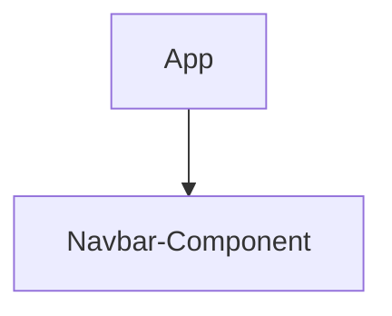

# Billia - A Fintech App

## Project Overview
This is a modern, responsive user-friendly Fintech web application built with React, TypeScript, and Ant Design components for providing payments services and solutions. The application design is streamlined to focus on user experience, accessibility, and clean design.

## Billia - Technical Documentation
This documentation provides an overview of the project's architecture, implementation approach, and design decisions. The codebase demonstrates a focus on maintainability, scalability, and user experience through careful component organization and modern development practices.

### Tech Stack
- **Frontend Framework**: React with TypeScript
- **UI Libraries:**
    - Ant Design (antd) for semantic and polymorphic HTML Element
    - Styled-components for creating reuseable styling
    - React-Router-Dom for cleint-side routing
    - React-Helmet-Async for SEO best practice and injecting metadata into pages
- **Build Tool**: Vite
- **Package Manager**: pnpm
- **Type Checking**: TypeScript
- **Code Quality/Stactic Code Analysis**: ESLint

### Architecture & Implementation

1. #### Component Structure
The application follows a modular component architecture:

```suggestion
src/
  components/
    Navbar/
        index.tsx                   # Address navbar component
        styles.ts                   # Address styling of navbar component
    hooks/
        use-window-size.ts          #Address window events such as resizing             
    utils/               
      constants.ts                  #Address breakpoints and app constans
    app.css
    app.tsx
    index.css
    main.tsx
```

#### App Component Tree


2. #### Implementation Approach
This implementation includes several optimizations and improvements:

The implementation ensures:
1. Fast initial page load
2. Smooth component loading
3. No layout shifts during loading
4. Clean and maintainable code
5. Optimal performance
6. Good user experience

Implementation of the app also look at:

##### Performance Optimizations:
- Component memoization using React.memo
- Memoized callback functions using useCallback
- Debounced window resize listener
- Conditional rendering of mobile drawer
- Optimized image loading with width/height attributes
- CSS animations hardware acceleration
- Efficient styled-components usage

##### Mobile-First Approach:
- Base styles for mobile devices
- Progressive enhancement for larger screens
- Responsive units using clamp()
- Touch-friendly mobile menu
- Optimized for various screen sizes

##### Accessibility Improvements:
- Semantic HTML structure
- ARIA labels for menu buttons
- Focus management
- Keyboard navigation support
- Proper color contrast
- Focus-visible outlines

##### UI/UX Enhancements:
- Smooth animations and transitions
- Touch-friendly tap targets
- Visual feedback on interactions
- Consistent spacing using clamp()
- Fallback styles for older browsers
- Improved mobile drawer experience

##### Code Organization:
- Separated constants and utilities
- Custom hook for window size
- Modular component structure
- Type-safe implementation
- Easy to maintain and extend

##### Responsive Features:
- Dynamic breakpoints
- Fluid typography
- Responsive spacing
- Adaptive layouts
- Flexible container widths

##### Browser Support:
- Fallbacks for backdrop-filter
- Cross-browser compatible animations
- Progressive enhancement approach
- Graceful degradation

### COMPONENT IMPLEMENTATION
It was ensured that each component had the following: 
- Highly performant with minimal re-renders
- Fully responsive across all devices
- Accessible to all users
- Easy to maintain and extend
- Optimized for both mobile and desktop
- Proper semantic HTML with main content area
- Clean component structure
- Separation of styled components
- Clear component responsibilities
- Type-safe implementation
- Efficient style reuse
- Minimal prop drilling
- No layout shifts
- Proper landmark elements
- Clear content organization
- Screen reader friendly


#### Benefits of the Chosen Approach

1. ##### Maintainability
    - Modular component structure
    - Clear separation of concerns
    - Type safety with TypeScript
    - Consistent styling patterns
2. ##### Performance
    - Memoized computations
    - Optimized rendering
    - Lazy loading potential
3. ##### Scalability
    - Easy to add new steps
    - Modular component architecture
    - Reusable styled components
    - Consistent pattern usage
4. ##### User Experience
    - Smooth animations
    - Responsive design
    - Clear visual feedback
    - Intuitive progress tracking


