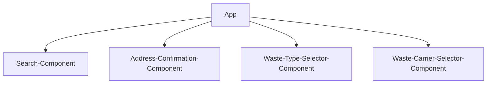

# Skip Hire - Waste Management Booking System

## Project Overview
This is a modern, responsive user-friendly Skip Hire service web application built with React, TypeScript, and a combination of Material-UI and Ant Design components for booking skip hire services. The application provides a streamlined, multi-step booking process with a focus on user experience, accessibility, and clean design.

## Skip Hire Service - Technical Documentation
This documentation provides an overview of the project's architecture, implementation approach, and design decisions. The codebase demonstrates a focus on maintainability, scalability, and user experience through careful component organization and modern development practices.

### Tech Stack
- **Frontend Framework**: React with TypeScript
- **UI Libraries:**
    - Material-UI (MUI)
    - Ant Design (antd)
    - Styled-components
- **Build Tool**: Vite
- **Package Manager**: pnpm
- **Type Checking**: TypeScript
- **Code Quality**: ESLint

### Architecture & Implementation

1. #### Component Structure
The application follows a modular component architecture:

```suggestion
src/
  components/
    search-bar.tsx         # Address search component
    address-form.tsx       # Address details form
    wast-type-selector.tsx # Waste type selection
    progress-tracker.tsx   # Step progress indicator
    styled/               
      index.ts            # Shared styled components
  mock/
    address-data.ts       # Mock address data
    waste-types.ts        # Mock waste type data
```

    1a. Component Tree


2. #### Implementation Approach

-  ##### Multi-step Form Process
The application implements a multi-step booking process:

1. Address Search
2. Address Form
3. Waste Type Selection
4. Skip Size Selection (planned)
5. Permit Check (planned)
6. Date Selection (planned)
7. Payment (planned)

- ##### State Management

- Uses React's useState for local state management
- Maintains form state between steps
- Implements step navigation with state preservation

- ##### UI/UX Design Decisions

1. ###### Dark Theme:
    - Enhanced visibility
    - Reduced eye strain
    - Modern aesthetic

2. ###### Glass-morphism Effects:
    - Backdrop filters
    - Subtle transparencies
    - Modern visual appeal

3. ###### Progressive Disclosure:
    - Step-by-step form progression
    - Clear visual feedback
    - Reduced cognitive load

4. ###### Responsive Design:
    - Mobile-first approach
    - Flexible layouts
    - Adaptive components

3. #### Key Features

- ##### Address Search
- Autocomplete functionality
- Real-time filtering
- Clear visual feedback
- Location-based results
- Memoized search results for performance

```js
const filteredOptions = useMemo(() => {
  if (!searchText) return [];
  return addressSuggestions.filter(...)
}, [searchText]);
```

- ##### Address Form
- Form validation with Ant Design Form
- Data persistence
- Error handling
- Loading states

- ##### Waste Type Selection
- Multi-select capability
- Visual feedback
- Restrictions information
- Category descriptions

- ##### Progress Tracking
- Visual step indicator
- Current step highlight
- Completion status
- Responsive design

4. #### Design Patterns
- ##### Component Composition
- Modular components
- Reusable styled components
- Clear component hierarchy

- ##### Form Handling
- Controlled components
- Form validation
- Error management
- State preservation

- ##### Styling Approach
- Styled-components for component-specific styles
- Theme consistency
- Responsive design patterns
- Animation management

5. #### Implementation Details

1. ##### Setup and Configuration
    - Project initialization with Vite
    - TypeScript configuration
    - ESLint setup for code quality

2. ##### Style/UI Framework Integration:
    - Combined Material-UI and Ant Design
    - Custom styled-components and theme configuration
    - Consistent theming
3. ##### Component Development
    - Core components creation
    - Mock data setup
    - Form validation implementation
    - Style system establishment
4. ##### Feature Implementation
    - Address search and filtering
    - Form validation and submission
    - Progress tracking
    - Multi-select waste type functionality
5. ##### Form Management:
    - Ant Design Form components
    - Custom validation
    - Error handling
6. ##### Animation:
    - Material-UI Fade transitions
    - CSS animations
    - Smooth state transitions
7. ##### Responsiveness:
    - Flexible grids
    - Responsive typography
    - Mobile-friendly interactions

6. #### Benefits of the Chosen Approach

1. ##### Maintainability
    - Modular component structure
    - Clear separation of concerns
    - Type safety with TypeScript
    - Consistent styling patterns
2. ##### Performance
    - Memoized computations
    - Optimized rendering
    - Lazy loading potential
3. ##### Scalability
    - Easy to add new steps
    - Modular component architecture
    - Reusable styled components
    - Consistent pattern usage
4. ##### User Experience
    - Smooth animations
    - Responsive design
    - Clear visual feedback
    - Intuitive progress tracking


