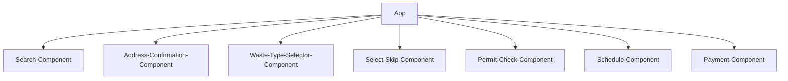

# Skip Hire - Waste Management Booking System

## Project Overview
This is a modern, responsive user-friendly Skip Hire service web application built with React, TypeScript, and a combination of Material-UI and Ant Design components for booking skip hire services. The application provides a streamlined, multi-step booking process with a focus on user experience, accessibility, and clean design.

## Skip Hire Service - Technical Documentation
This documentation provides an overview of the project's architecture, implementation approach, and design decisions. The codebase demonstrates a focus on maintainability, scalability, and user experience through careful component organization and modern development practices.

### Tech Stack
- **Frontend Framework**: React with TypeScript
- **UI Libraries:**
    - Material-UI (MUI)
    - Ant Design (antd)
    - Styled-components
- **Build Tool**: Vite
- **Package Manager**: pnpm
- **Type Checking**: TypeScript
- **Code Quality/Stactic Code Analysis**: ESLint

### Architecture & Implementation

1. #### Component Structure
The application follows a modular component architecture:

```suggestion
src/
  components/
    search-bar.tsx         # Address search component
    address-form.tsx       # Address details form
    wast-type-selector.tsx # Waste type selection
    progress-tracker.tsx   # Step progress indicator
    styled/               
      index.ts            # Shared styled components
      skeleton.tsx            # Shared skeleton loading effect component
    modals/
      heavy-waste-modal.tsx             # Heavy Waste modal compoent
      heavy-waste-percentage-modal.tsx  # Heavy Waste Percentage modal compoent
      no-heavy-waste-modal.tsx          # No Heavy Waste modal compoent
      payment-modal.tsx                 # Payment modal compoent
      plasterboard-percentage-modal.tsx # Plasterboard Percentage modal compoent
      private-road-modal.tsx            # Private Property modal compoent
      public-road-modal.tsx             # Public Road modal compoent
  mock/
    address-data.ts       # Mock address data
    waste-types.ts        # Mock waste type data
```

    1a. Component Tree


2. #### Implementation Approach

-  ##### Multi-step Form Process
The application implements a multi-step booking process:

1. Address Search
2. Address Form
3. Waste Type Selection
4. Skip Size Selection 
5. Permit Check 
6. Date Selection 
7. Payment 

- ##### State Management

- Uses React's useState for local state management
- Maintains form state between steps
- Implements step navigation with state preservation

- ##### UI/UX Design Decisions

1. ###### Dark Theme:
    - Enhanced visibility
    - Reduced eye strain
    - Modern aesthetic

2. ###### Glass-morphism Effects:
    - Backdrop filters
    - Subtle transparencies
    - Modern visual appeal

3. ###### Progressive Disclosure:
    - Step-by-step form progression
    - Clear visual feedback
    - Reduced cognitive load

4. ###### Responsive Design:
    - Mobile-first approach
    - Flexible layouts
    - Adaptive components

3. #### Key Features

- ##### Address Search
- Autocomplete functionality
- Real-time filtering
- Clear visual feedback
- Location-based results
- Memoized search results for performance

```js
const filteredOptions = useMemo(() => {
  if (!searchText) return [];
  return addressSuggestions.filter(...)
}, [searchText]);
```

6. #### Benefits of the Chosen Approach

1. ##### Maintainability
    - Modular component structure
    - Clear separation of concerns
    - Type safety with TypeScript
    - Consistent styling patterns
2. ##### Performance
    - Memoized computations
    - Optimized rendering
    - Lazy loading potential
3. ##### Scalability
    - Easy to add new steps
    - Modular component architecture
    - Reusable styled components
    - Consistent pattern usage
4. ##### User Experience
    - Smooth animations
    - Responsive design
    - Clear visual feedback
    - Intuitive progress tracking


